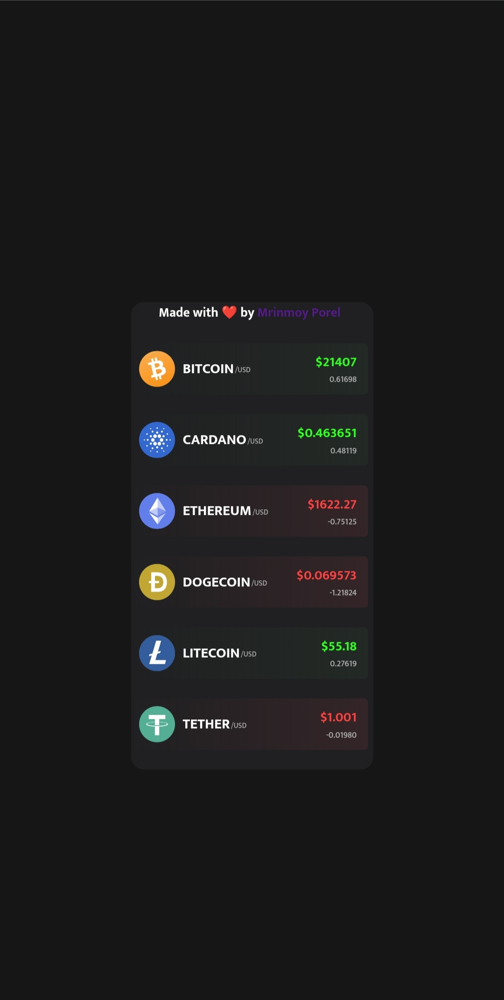

# 📊 A Crypto Price Tracking App

<h2> An App that tracks prices of certain crypto tokens,   with the help of API.</h2>

 
<h3>
- Made using HTML, CSS and JavaScript.
 
- It fetches data from Coingecko API.
 
- It also displays the change in price in 24 hours.
 
- It also changes colours according to the change in price rance.
 
- i.e., if the price increases the token div changes to green,
    and if the price decreases it changes to red.
 
- Hosted on Netlify 
  <a href="https://crypto-price-tracker-mrinnnmoy.netlify.app/" target="_blank">Visit 🚀</a>
</h3>

# 🖼 Preview Image

#  Made with ❤️ by <a href="https://www.linkedin.com/in/mrinnnmoy/" target="_blank">Mrinmoy Porel</a>
 
